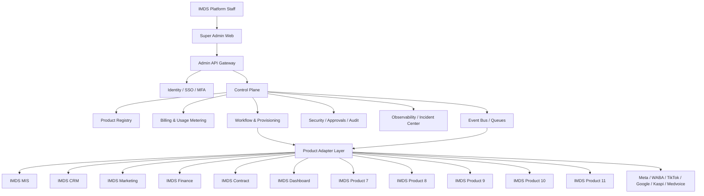
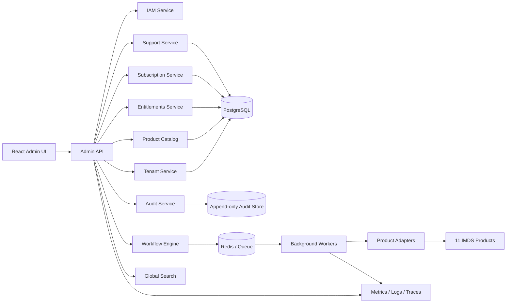
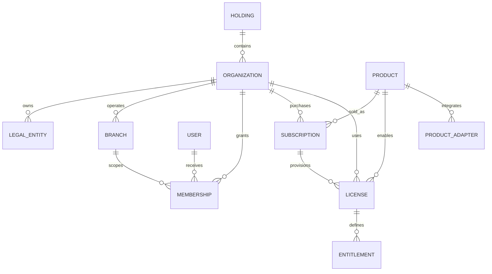
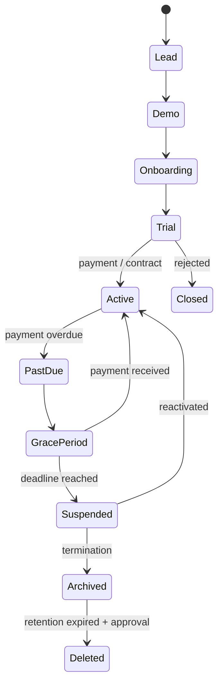

# IMDS Super Admin — Architecture

## 1. Context architecture



**Boundary:** Super Admin stores control-plane data. Operational, medical, CRM and financial records remain in their respective products.

## 2. Service architecture



## 3. Multi-tenant domain model



Hierarchy:

```text
Holding
└── Organization / tenant
    ├── Legal entities (BIN)
    ├── Branches
    ├── Users and memberships
    ├── Subscriptions
    └── Product licenses and entitlements
```

## 4. Customer lifecycle



## Core modules

1. Identity Directory and RBAC.
2. Companies, holdings, legal entities and branches.
3. Product Registry and adapter contracts.
4. Licenses, subscriptions, tariffs and entitlements.
5. Workflow and automated provisioning.
6. Usage metering and billing.
7. Event bus, webhooks and background jobs.
8. Security, approvals, impersonation and break-glass access.
9. Audit, observability, incidents and status management.
10. Customer onboarding, support, SLA and health score.
11. Data governance, retention, export, backup and disaster recovery.

## Mandatory security rules

- MFA for global administrators.
- Deny-by-default permissions.
- Tenant scoping on every control-plane entity.
- No direct browser access to product databases.
- Impersonation requires reason, time limit and immutable audit event.
- Secrets are encrypted and never returned in full.
- Dangerous commands require approval by a second authorized user.
- Audit events are append-only and retained separately from operational logs.
