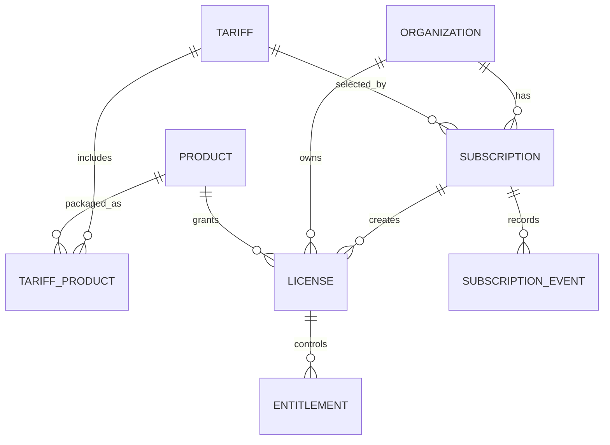
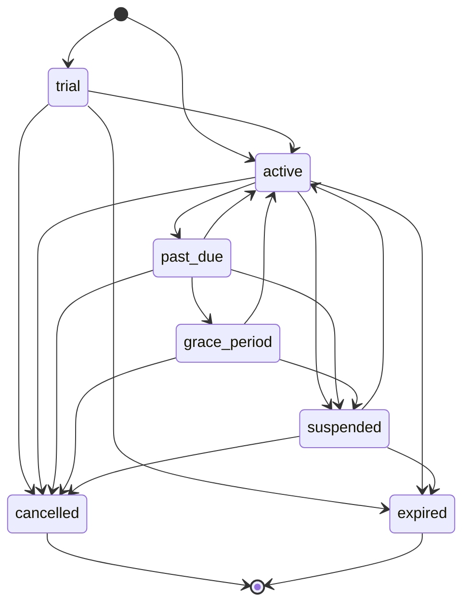

# Billing, subscriptions and licensing

## Responsibility boundary

IMDS Super Admin owns commercial access:

- tariffs and product composition;
- subscriptions and billing periods;
- product licenses for each organization;
- limits and feature entitlements;
- commercial lifecycle events and audit history.

Operational medical, CRM, marketing and financial records remain in the product databases.

## Entity model



## Subscription lifecycle



Transitions outside this graph are rejected in PostgreSQL.

## License lifecycle

```text
pending -> provisioning -> active -> suspended -> active
                                 -> failed
active/suspended/pending -> revoked
```

- A subscription creates one license per organization and product.
- A unique database constraint prevents duplicate organization/product licenses.
- Suspending a subscription suspends its retained licenses.
- Cancelling or expiring a subscription revokes its licenses.
- Restoring a subscription returns provisioned licenses to `active` and unprovisioned licenses to `pending`.

## Entitlements

Entitlements are materialized per license.

Examples:

```text
crm.kanban = true
crm.max_users = 25
limit.storage_gb = 100
marketing.meta_ads = true
mis.max_branches = 3
```

Sources:

- `tariff` — inherited from the selected tariff;
- `override` — an explicit, audited exception;
- future `promotion` or `contract` sources may be added without changing product data.

Overrides require a reason and are written to the immutable platform audit stream.

## Activation transaction

`activate_subscription()` performs one database transaction:

1. validates organization and tariff;
2. validates selected products;
3. creates the subscription;
4. creates or rebinds product licenses;
5. materializes tariff entitlements and limits;
6. appends a subscription event;
7. appends a security audit event.

Actual tenant provisioning is asynchronous and belongs to the next layer: Workflow & Provisioning Orchestrator.
