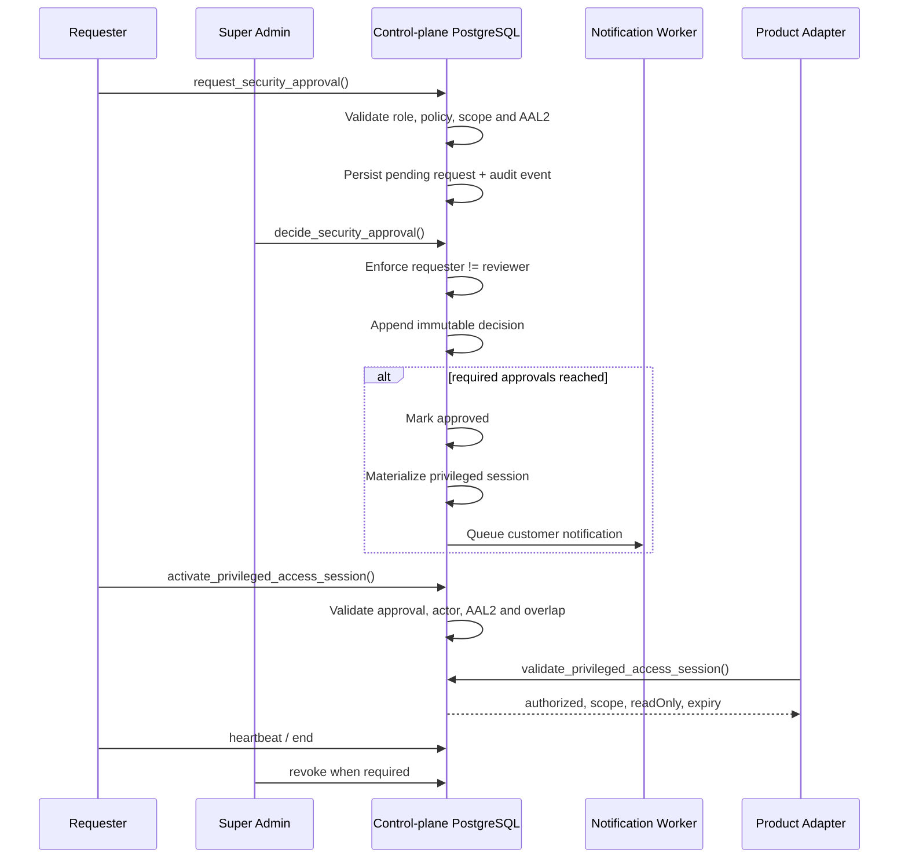
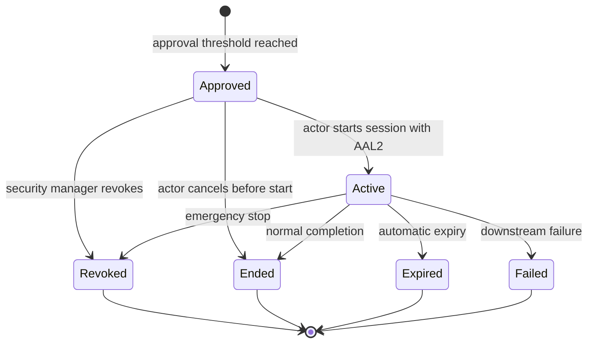

# Security Approval Center

## Purpose

Security Approval Center is the control-plane gate for destructive, financial and privileged operations.

It implements:

- four-eyes approval;
- multi-reviewer critical actions;
- AAL2 multi-factor authentication;
- time-boxed support impersonation;
- break-glass emergency access;
- privileged maintenance sessions;
- customer notification requirements;
- append-only decision and session histories;
- tamper-evident audit chaining.

The Security Center does not issue product credentials to the browser. A downstream product or adapter must validate the privileged session through a trusted service-side call before honoring access.

## Approval flow



## Seeded policies

| Policy | Risk | Approvals | Maximum duration | Customer notification |
|---|---:|---:|---:|---:|
| `support.impersonation.readonly` | High | 1 | 60 min | Required |
| `support.impersonation.write` | Critical | 2 | 30 min | Required |
| `security.break_glass` | Critical | 2 | 30 min | Required |
| `security.maintenance` | High | 1 | 120 min | Required |
| `billing.refund.large` | Critical | 2 | 60 min | Not required by default |
| `organization.delete` | Critical | 2 | 60 min | Required |
| `product.disable.global` | Critical | 2 | 60 min | Not required by default |
| `entitlement.override` | High | 1 | 1440 min | Not required by default |

## Mandatory rules

1. The requester cannot approve or reject their own request.
2. Each reviewer may make only one decision per request.
3. Critical policies can require two independent approvals.
4. MFA is checked from the authenticated JWT `aal` claim.
5. Approved scope, actor, organization, product and duration are immutable.
6. A user can have only one active privileged session per organization.
7. Sessions cannot be reopened after expiry, revocation, completion or failure.
8. Product adapters must validate session status, expiry, actor state, tenant state, customer notification and required scope.
9. Security decisions and session events are append-only.
10. Direct browser writes to security tables are denied; changes use guarded RPC functions.

## Privileged session lifecycle



## Service-side authorization

Products must never trust a browser flag such as `isSuperAdmin`.

Before serving privileged data or allowing a privileged mutation, the adapter calls:

```sql
select public.validate_privileged_access_session(
  session_id_value := '<uuid>',
  required_scope_value := 'crm.deals.read'
);
```

The function returns a JSON object containing:

- `authorized`;
- denial `reason` when rejected;
- actor, organization, product and target user IDs;
- read-only mode;
- approved scopes;
- expiry;
- correlation ID.

Only a trusted service-role backend can execute this validation RPC.

## Audit integrity

Version 2 audit events form an ordered hash chain per scope:

```text
platform
organization UUID A
organization UUID B
...
```

Each event stores:

- `sequence_number`;
- `previous_hash`;
- `hash`;
- `integrity_version`.

`write_audit_event()` serializes writes for each scope with a PostgreSQL advisory transaction lock. `verify_audit_chain()` recomputes hashes and checks chain continuity.

The chain is tamper-evident, not a replacement for external immutable backup. Audit exports should also be copied to separate retention storage in the Data Governance phase.

## Customer notification outbox

When policy requires notification, the database inserts a durable record into `security_notification_outbox` for:

- approval/materialization;
- session start;
- session end;
- session revocation.

The future notification worker will deliver through in-app, email, SMS, WhatsApp or webhook channels. A privileged session that requires notification is not considered valid by a product adapter until `client_notified_at` is recorded.

## UI sections

Security Center contains:

1. Approval queue with search, status and risk filters.
2. Independent approve/reject decisions.
3. Privileged session activation, heartbeat, completion and revocation.
4. Approval policy catalogue.
5. Audit-chain verification and recent security events.
6. Demo adapter when Supabase is not configured.
