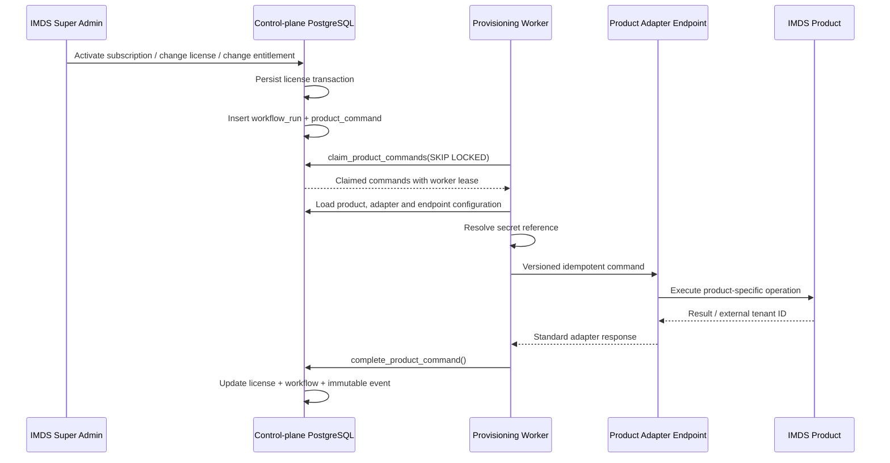

# Workflow and Product Provisioning Orchestrator

## Responsibility boundary

The orchestrator converts control-plane state into idempotent commands for individual IMDS products.

It does not store medical, CRM, marketing or financial operational records. It stores only:

- workflow state;
- product commands;
- idempotency and correlation identifiers;
- retry metadata;
- sanitized product responses;
- immutable workflow events.

## Command flow



## Durable outbox

`product_commands` is the durable command outbox.

A command is inserted in the same PostgreSQL transaction that changes the license or entitlement. This prevents the control plane from committing a commercial state change without persisting the corresponding product operation.

Each command contains:

- `idempotency_key` — duplicate delivery protection;
- `correlation_id` — tracing across the control plane and product;
- `attempts` and `max_attempts`;
- `available_at` — retry schedule;
- `locked_at` and `locked_by` — worker lease;
- sanitized `payload` and `response`;
- `adapter_id` and `endpoint_id` selected at enqueue time.

## Automatic commands

| Control-plane event | Product command |
|---|---|
| New pending license | `provision_tenant` |
| Active license becomes suspended | `suspend_tenant` |
| Suspended license becomes active | `resume_tenant` |
| License becomes revoked | `revoke_tenant` |
| Entitlement changes | `sync_entitlements` |
| Manual owner onboarding | `invite_owner` |

## Worker concurrency

`claim_product_commands()` uses `FOR UPDATE SKIP LOCKED`.

Multiple workers may run simultaneously without claiming the same command. A command moves from `queued` to `processing` and receives a worker lease.

If a worker crashes, `requeue_stale_product_commands()` releases stale leases. Commands that have exhausted their attempts move to `dead_letter`.

## Retry policy

Retryable failures:

- network failures;
- timeout;
- HTTP 408, 425 and 429;
- HTTP 5xx;
- adapter response with `retryable: true`.

Non-retryable failures move directly to `dead_letter`:

- unsupported adapter protocol;
- missing secret reference;
- invalid endpoint configuration;
- non-retryable HTTP 4xx;
- adapter response with `retryable: false`.

Retry delay uses exponential backoff capped at 15 minutes.

## Product adapter request

Default endpoint:

```text
POST {base_url}/control-plane/v1/commands
```

The command path may be overridden by `product_endpoints.config.command_path`.

Example body:

```json
{
  "commandId": "uuid",
  "command": "provisionTenant",
  "contractVersion": "1.0",
  "productKey": "imds-crm",
  "organizationId": "uuid",
  "externalTenantId": null,
  "requestedAt": "2026-08-02T10:00:00Z",
  "idempotencyKey": "license:...:provision_tenant:...",
  "correlationId": "uuid",
  "payload": {
    "license_id": "uuid",
    "entitlements": {
      "crm.max_users": 25
    }
  }
}
```

Expected response:

```json
{
  "commandId": "uuid",
  "status": "completed",
  "externalTenantId": "tenant-123",
  "retryable": false,
  "data": {}
}
```

## Authentication modes

- `none` — only for isolated internal environments;
- `service_token` — bearer token resolved from a secret reference;
- `oauth2` — bearer access token resolved from a secret reference;
- `signed_request` — HMAC SHA-256 signature over timestamp and request body.

The browser never receives product credentials.

Supported secret reference forms:

```text
env://CRM_PRODUCTION_SERVICE_TOKEN
vault://imds/products/crm/production
```

For `vault://` references, the worker currently resolves the mapping from `IMDS_SECRET_REFERENCE_MAP`. A dedicated secrets manager adapter can replace this resolver without changing product endpoint records.

## Edge Function environment

Required:

```text
SUPABASE_URL
SUPABASE_SERVICE_ROLE_KEY
IMDS_PROVISIONING_WORKER_TOKEN
```

Optional:

```text
IMDS_SECRET_REFERENCE_MAP={"vault://imds/products/crm/production":"secret-value"}
```

Invoke the worker through a protected scheduler:

```http
POST /functions/v1/provisioning-worker
x-imds-worker-token: <IMDS_PROVISIONING_WORKER_TOKEN>
content-type: application/json

{
  "workerId": "provisioning-worker-1",
  "batchSize": 10,
  "staleAfterSeconds": 300
}
```

## Security rules

- only `service_role` may claim or complete commands;
- platform and technical admins may retry or cancel failed commands;
- manual commands are validated against current license state;
- product secrets are referenced, not stored in command payloads;
- response objects are sanitized and truncated before persistence;
- workflow events are append-only;
- retries, cancellations and manual commands are written to the platform audit stream;
- production endpoints must already be active in Product Registry.
